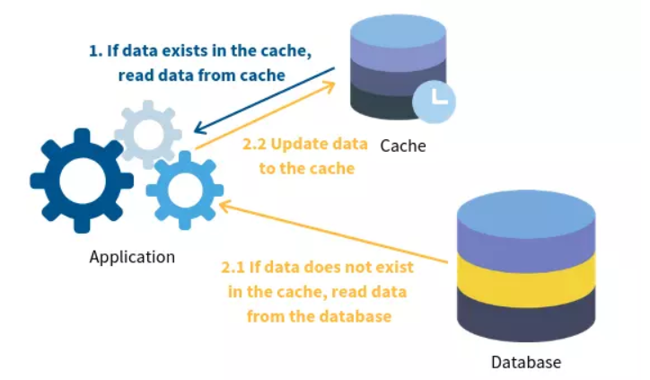
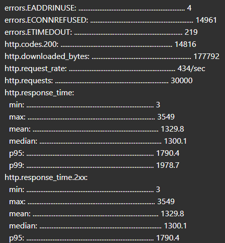
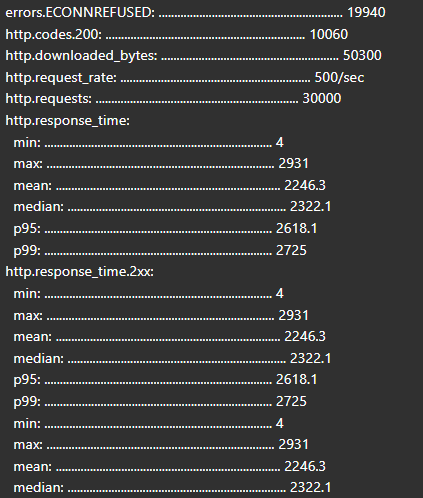
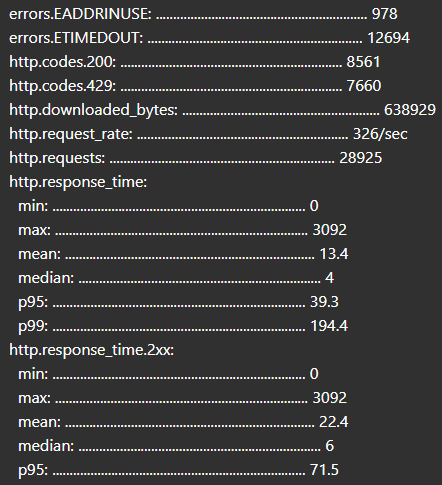

# Nhóm 18:
Thành viên trong nhóm:
- 22026552 Nguyễn Văn Quân
- 22026507 Mai Tiến Mạnh
# ShortURL Service

ShortURL Service là một ứng dụng rút gọn URL hiệu quả, tối ưu hóa để xử lý nhanh chóng các yêu cầu thông qua cơ sở dữ liệu MongoDB, bộ nhớ đệm Redis, và hỗ trợ giới hạn tốc độ (Rate Limiting) để bảo mật.

---

## Tính năng chính

- **Rút gọn URL**: Tạo mã ngắn duy nhất cho mỗi URL gốc.
- **Truy xuất URL gốc**: Lấy lại URL gốc từ mã rút gọn.
- **Lưu trữ hiệu quả**: Sử dụng MongoDB để lưu trữ, Redis để cache tăng tốc truy xuất.
- **Kiểm tra hợp lệ URL**: Đảm bảo chỉ nhận URL hợp lệ.
- **Giới hạn tốc độ (Rate Limiting)**: Ngăn chặn spam/tấn công DDoS.
- **Retry Pattern**: Tự động thử lại thao tác khi gặp lỗi tạm thời (DB, Redis).
- **Hỗ trợ CORS**: Cho phép tích hợp với các ứng dụng web khác.
- **Giao diện web**: Có sẵn UI đơn giản tại `/public`.

---

## Yêu cầu hệ thống

- Node.js v16+
- MongoDB (mặc định: `mongodb://localhost:27017/shorturl`)
- Redis (mặc định: `127.0.0.1:6379`)
- npm

---

## Cài đặt & Khởi động

1. **Clone repository:**
   ```bash
   git clone https://github.com/manhtienmai/Short_Link.git
   cd Short_Link
   ```

2. **Cài đặt dependencies:**
   ```bash
   npm install
   ```

3. **Cấu hình môi trường:**
   Tạo file `.env` ở thư mục gốc với nội dung:
   ```
   MONGODB_URI=mongodb://localhost:27017/shorturl
   REDIS_HOST=127.0.0.1
   REDIS_PORT=6379
   ```

4. **Chạy ứng dụng:**
   ```bash
   npm run dev
   ```
   Server chạy tại [http://localhost:3001](http://localhost:3001). 
---

## API Endpoints

### 1. Tạo short URL

- **Endpoint:** `POST /create?url=<url-goc>`
- **Request:**  
  - Query string: `url` (bắt buộc)
- **Response:**  
  - Thành công (200):  
    ```json
    "abc12"
    ```
  - Lỗi (400):  
    ```json
    { "error": "URL para is required" }
    ```
  - Lỗi định dạng:  
    ```json
    { "error": "invalid url format" }
    ```
  - Vượt quá giới hạn request (429):
    ```json
    { "error": "Too Many Requests" }
    ```
### 2. Lấy URL gốc từ short ID

- **Endpoint:** `GET /short/:id`
- **Response:**
  - Thành công (200):  
    ```
    https://example.com
    ```
  - Không tìm thấy (404):  
    ```html
    <h1>404 Not Found</h1>
    ```
  - Vượt quá giới hạn request (429):
    ```json
    { "error": "Too Many Requests" }
    ```

### 3. Giao diện web

- **Endpoint:** `GET /`
- Trả về trang HTML đơn giản cho phép nhập URL và nhận link rút gọn.

---

## Cơ chế hoạt động & Thiết kế

### 1. **Kiến trúc tổng quan**
- **Express.js**: Framework backend chính.
- **MongoDB**: Lưu trữ cặp (id, url).
- **Redis**: Cache 2 chiều (id <-> url) để tăng tốc truy xuất.
- **Mongoose**: ODM cho MongoDB.
- **Rate Limiter**: Sử dụng `rate-limiter-flexible` với Redis để giới hạn 100 request/10 giây mỗi IP.
- **Retry Pattern**: Dùng `async-retry` để tự động thử lại thao tác DB/Redis khi gặp lỗi tạm thời (3 lần, delay 1-5s).

### 2. **Luồng xử lý chính**

#### a. Tạo short URL (`POST /create`)
- Kiểm tra hợp lệ URL.
- Kiểm tra cache Redis: Nếu đã có, trả về id.
- Nếu chưa có, kiểm tra DB: Nếu đã có, trả về id.
- Nếu chưa có, sinh id ngẫu nhiên (5 ký tự, dùng crypto), kiểm tra trùng, lưu vào DB và cache.
- Trả về id.

#### b. Lấy URL gốc (`GET /short/:id`)
- Kiểm tra cache Redis: Nếu có, trả về URL.
- Nếu không, kiểm tra DB: Nếu có, trả về URL và lưu vào cache.
- Nếu không có, trả về 404.

#### c. **Rate Limiting**
- Middleware kiểm tra số lượng request từ mỗi IP.
- Nếu vượt quá 1000 request/10s, trả về 429.

#### d. **Retry Pattern**
- Các thao tác DB/Redis được bọc bởi `callWithRetry` (tối đa 3 lần thử lại nếu lỗi).
vi
#### e. **Cache Aside**
- Khi truy xuất, ưu tiên lấy từ cache, nếu không có thì lấy từ DB rồi lưu vào cache.

---
### f. **Cơ chế caching đa tầng**
- Ứng dụng sử dụng cache đa tầng để tối ưu hiệu năng và giảm tải cho cơ sở dữ liệu
- Các tầng cache:
  - Memory Cache (Tier 1): cache nhanh nhất, lưu trữ trực tiếp trong bộ nhớ của Node.js
  - Redis cache (Tier 2)
  - MongoDB (Tier 3): lưu trữ dài hạn
## Cấu trúc thư mục

```
.
├── server.js                # Khởi tạo server, định nghĩa route
├── utils.js                 # Logic xử lý rút gọn URL, cache, validate
├── middleware.js            # Các middleware: rate limit, logger, validate, error handler
├── optimizer/
│   ├── mongoDBConfig.js     # Kết nối và định nghĩa model MongoDB
│   ├── redisConfig.js       # Kết nối và thao tác với Redis
│   └── retryHelper.js       # Hàm retry pattern
│   └── memoryCache.js       # Thiết lập các hàm liên quan in-memory

├── public/                  # Giao diện web (index.html, script.js, styles.css)
├── db/                      # (Có thể chứa file SQLite cũ, không còn dùng)
├── res/
│   └── cache.png            # Minh họa cache-aside
├── test-api.yml             # Kịch bản test hiệu năng với Artillery
├── package.json
└── README.md
```

---

## Một số tối ưu & lưu ý

### 1. **Chuyển từ SQLite sang MongoDB với ODM (Mongoose)**
- Ban đầu nhóm có cải tiến bằng việc sử dụng thư viện Sequelize để định nghĩa Schema cho model Link.
- Sử dụng ORM để viết hai hàm findOriginORM và createORM trong [branch dev-v0.1 và trong file utils](https://github.com/manhtienmai/Short_Link/blob/dev-v0.1/utils.js).

- Tuy nhiên, do SQLite có hạn chế trong việc xử lý nhiều kết nối đồng thời, dẫn đến hiện tượng nghẽn cổ chai khi truy cập dữ liệu song song, nhóm đã đề xuất chuyển sang sử dụng MongoDB làm cơ sở dữ liệu chính và xây dựng lại lớp persistent layer sử dụng ODM Mongoose.

- **Ưu điểm:**
  - **Khả năng mở rộng cao:** MongoDB là NoSQL, phù hợp cho dữ liệu lớn, dễ scale horizontal.
  - **Tối ưu truy vấn:** Truy vấn nhanh hơn, hỗ trợ index tốt cho các trường thường xuyên tìm kiếm (id, url).
  - **ODM Mongoose:** Định nghĩa schema rõ ràng, tự động validate, dễ bảo trì và mở rộng model.
- **Chi tiết code:**  
  - Định nghĩa schema và model trong `optimizer/mongoDBConfig.js`.
  - Kết nối MongoDB qua biến môi trường, log trạng thái kết nối.

---

### 2. **Thêm Redis Cache (Cache-Aside Pattern)**
  <p>
    
   </p>

 - **Công nghệ sử dụng**: Redis
 
 - **Cơ chế**: 
      - **Read-Through** (Đọc dữ liệu):
      Khi ứng dụng cần một dữ liệu, nó sẽ kiểm tra xem dữ liệu đã có trong cache chưa.
      Nếu có (cache hit), trả về dữ liệu từ cache.
      Nếu không có (cache miss), ứng dụng sẽ lấy dữ liệu từ nguồn dữ liệu chính (database), lưu vào cache, và sau đó trả về dữ liệu cho client.

     - **Write-Through** (Ghi dữ liệu):
      Khi dữ liệu được cập nhật, ứng dụng sẽ cập nhật trực tiếp vào cơ sở dữ liệu và có thể cập nhật thủ công vào cache (hoặc để dữ liệu cũ trong cache hết hạn tự động).
- **Ưu điểm:**
  - **Tăng tốc truy xuất:** Lấy dữ liệu từ Redis nhanh hơn nhiều so với DB.
  - **Giảm tải cho MongoDB:** Truy vấn cache trước, chỉ truy vấn DB khi cache miss.
  - **Cache 2 chiều:** Lưu cả id→url và url→id, tối ưu lookup cả hai chiều.
  - **Tự động hết hạn:** Dữ liệu cache có TTL, giảm nguy cơ dữ liệu cũ không nhất quán.
- **Chi tiết code:**  
  - Kết nối và thao tác cache trong `optimizer/redisConfig.js`.
  - Sử dụng Promise.all để ghi cache song song, tăng hiệu suất.
  - Áp dụng cache-aside trong các hàm `findOrigin`, `shortUrl` (`utils.js`).

---

### 3. **Kiểm tra URL hợp lệ trước khi tạo short URL**
- **Ưu điểm:**
  - **Đảm bảo dữ liệu đầu vào chuẩn:** Tránh lưu các URL không hợp lệ vào hệ thống.
  - **Giảm lỗi phát sinh khi redirect hoặc truy xuất URL gốc.
- **Chi tiết code:**  
  - Middleware `validateUrl` trong `middleware.js` kiểm tra query `url` và validate định dạng.
  - Hàm `isValidUrl` trong `utils.js` kiểm tra tiền tố `http://` hoặc `https://`.

---

### 4. **Rate Limiting (Giới hạn tốc độ)**
- **Ưu điểm:**
  - **Bảo vệ API:** Ngăn chặn spam, tấn công DDoS, lạm dụng dịch vụ.
  - **Công bằng cho người dùng:** Mỗi IP chỉ được phép gửi tối đa 1000 request/10 giây.
  - **Dễ mở rộng:** Sử dụng Redis làm backend, phù hợp cho hệ thống nhiều node.
- **Chi tiết code:**  
  - Middleware `rateLimit` trong `middleware.js` sử dụng `rate-limiter-flexible` với Redis.
  - Trả về HTTP 429 nếu vượt quá giới hạn.

---

### 5. **Retry Pattern (Tự động thử lại thao tác khi lỗi tạm thời)**
- **Ưu điểm:**
  - **Tăng độ ổn định:** Tự động thử lại thao tác DB/Redis khi gặp lỗi tạm thời (network, timeout...).
  - **Giảm lỗi do sự cố nhất thời:** Đặc biệt hữu ích khi làm việc với hệ thống phân tán.
- **Chi tiết code:**  
  - Hàm `callWithRetry` trong `optimizer/retryHelper.js` sử dụng package `async-retry`.
  - Áp dụng cho các thao tác DB/Redis trong các route chính (`server.js`).

---

### 6. **Refactor code & tối ưu hiệu suất**
- **Ưu điểm:**
  - **Sinh ID bảo mật:** Dùng `crypto.randomBytes` thay vì `Math.random` để sinh ID ngẫu nhiên, khó đoán, an toàn hơn.
  - **Tối ưu vòng lặp:** Sử dụng `Array.from` để chuyển bytes thành ký tự, code ngắn gọn, hiệu suất cao.
  - **Giới hạn số lần thử sinh ID:** Tránh vòng lặp vô hạn khi tạo ID mới, chỉ thử tối đa 10 lần.
  - **Ghi cache song song:** Dùng `Promise.all` để ghi cache 2 chiều cùng lúc, giảm thời gian chờ.
- **Chi tiết code:**  
  - Hàm `makeID`, `shortUrl`, `findOrigin` trong `utils.js`.

---

### 7. **Middleware bảo vệ & hỗ trợ API**
- **Ưu điểm:**
  - **Ghi log request:** (Có thể bật/tắt) giúp theo dõi, debug, kiểm soát truy cập.
  - **Xử lý lỗi tập trung:** Middleware `errorHandler` giúp trả về lỗi chuẩn, log lỗi server.
  - **Xử lý route không tồn tại:** Middleware `notFound` trả về lỗi 404 chuẩn RESTful.
  - **Hỗ trợ CORS:** Cho phép các ứng dụng web khác truy cập API dễ dàng.
- **Chi tiết code:**  
  - Các middleware trong `middleware.js`, sử dụng trong `server.js`.

---


## Test hiệu năng


## 🧪 Kịch bản kiểm thử bằng Artillery

Dưới đây là kịch bản kiểm thử tải lớn được sử dụng với Artillery:

```yaml
config:
  target: "http://localhost:3001"
  phases:
    - duration: 60         # test 60 giây
      arrivalRate: 500     # 500 requests/giây
```

### ▶️ Lệnh chạy test

```bash
artillery run --output report-get.json test-api-get.yml
artillery run --output report-post.json test-api-post.yml

```

### 📂 Xem kết quả

* File kết quả: `report-get.json` `report-post.json`


### 📊 Kết quả kiếm thử

Sau khi thực hiện test với 30000 request trong 60s, nhóm có kết quả như sau:

<b>1. Kết quả khi sử dụng phần code được cung cấp</b>
- GET:
<p>
    
</p>

- POST: 

<p>
    
</p>

<b>2. Kết quả khi đã thực hiện tối ưu code và kiến trúc</b>
- GET: 
<p>
    
</p>

- POST: 

<p>
    
</p>


# 📊 Đánh giá kết quả

## 🔍 API GET

| **Chỉ số**                      | **Trước cải tiến** | **Sau cải tiến** | **Nguyên nhân khác biệt**                                                                       |
| ------------------------------- | ------------------ | ---------------- | ----------------------------------------------------------------------------------------------- |
| **errors.ECONNREFUSED**         | 14 961             | 0                | Chuyển từ SQLite (dễ lock/I/O) sang MongoDB + retry → hầu như không còn từ chối kết nối.        |
| **errors.EADDRINUSE**           | 4                  | 978              | Rate-limiter giới hạn kết nối, retry mở nhiều kết nối mới nhanh → port exhaustion.              |
| **errors.ETIMEDOUT**            | 219                | 12 694           | Nhiều request bị giữ trong hàng đợi rate-limiter đến timeout; một số fallback sang DB gốc chậm. |
| **http.request\_rate**          | 434 req/sec        | 326 req/sec      | Redis-based rate-limiter giới hạn xuống \~326/sec để bảo vệ hệ thống.                           |
| **http.downloaded\_bytes**      | 177 792 bytes      | 638 929 bytes    | Cache Redis trả nhanh nội dung → lượng dữ liệu tải tăng gấp \~3,6×.                             |
| **http.response\_time.mean**    | 1 329,8 ms         | 13,4 ms          | Hầu hết request được phục vụ từ Redis hoặc Mongo nhanh; SQLite I/O bị loại bỏ.                  |
| **http.response\_time.median**  | 1 300,1 ms         | 4 ms             | Median giảm mạnh nhờ cache hit cao.                                                             |
| **http.response\_time.p95**     | 1 790,4 ms         | 39,3 ms          | 95% request nhanh nhờ cache, tuy có vài fallback sang Mongo/chờ retry.                          |
| **http.response\_time.p99**     | 1 978,7 ms         | 194,4 ms         | Top 1% chậm do retry timeout, truy vấn Mongo hoặc rate-limiter queue.                           |
| **http.codes.200**              | 14 816             | 8 561            | Nhiều request bị rate-limit → trả 429.                                                          |
| **http.codes.429**              | 0                  | 7 660            | Rate-limiter chủ động trả 429 khi vượt ngưỡng.                                                  |
| **http.responses**              | 14 816             | 16 221           | Tổng responses tăng (bao gồm cả 429).                                                           |
| **vusers.completed**            | 14 816             | 16 221           | Retry + cache giúp nhiều virtual user hoàn thành hơn.                                           |
| **vusers.failed**               | 15 184             | 13 672           | Giảm 1 500 failures nhờ retry & cache giảm tải DB.                                              |
| **vusers.session\_length.mean** | 3 085 ms           | 84,5 ms          | Session ngắn hơn nhiều do response time giảm sâu.                                               |
| **vusers.session\_length.p95**  | 8 692,8 ms         | 62,2 ms          | 95% session dưới 63 ms, cải thiện hơn 100×.                                                     |
| **vusers.session\_length.p99**  | 9 047,6 ms         | 2 416,8 ms       | 1% chậm nhất do tail latency và retry chậm.                                                     |

---

## 🔄 API POST

| **Chỉ số**                    | **Trước cải tiến**                                                   | **Sau cải tiến**                                               | **Nguyên nhân khác biệt**                                                                               |
| ----------------------------- | -------------------------------------------------------------------- | -------------------------------------------------------------- | ------------------------------------------------------------------------------------------------------- |
| **Lỗi kết nối**               | `ECONNREFUSED`: 19 940                                               | `EADDRINUSE`: 1 635<br>`ETIMEDOUT`: 10 706                     | SQLite → MongoDB + retry loại bỏ ECONNREFUSED; retry mở nhiều kết nối → `EADDRINUSE`, `ETIMEDOUT`.      |
| **HTTP Status Codes**         | `200`: 10 060                                                        | `201`: 8 917<br>`429`: 7 678                                   | Trước gộp mọi thành công thành 200; sau phân biệt rõ 201 và trả 429 khi vượt rate-limit.                |
| **Request rate / Throughput** | 500 req/sec → 30 000 total                                           | 229 req/sec → 28 156 total                                     | Rate-limiter giảm từ 500→229 req/sec để bảo vệ hệ thống; một số request bị chặn hoặc timeout.           |
| **Dung lượng tải về**         | 50 300 bytes                                                         | 436 163 bytes                                                  | Redis cache tăng hit rate, phục vụ nhanh và nhiều dữ liệu hơn (metadata, doc).                          |
| **Thời gian đáp ứng (all)**   | mean: 2 246 ms<br>median: 2 322 ms<br>p95: 2 618 ms<br>p99: 2 725 ms | mean: 16,7 ms<br>median: 3 ms<br>p95: 13,9 ms<br>p99: 497,8 ms | Trung bình & median giảm mạnh nhờ cache & MongoDB; tail (p99) còn \~500 ms do fallback hoặc retry chậm. |
| **Thời gian đáp ứng (2xx)**   | mean: 2 246 ms<br>p95: 2 618 ms<br>p99: 2 725 ms                     | mean: 28,6 ms<br>p95: 40,9 ms<br>p99: 671,9 ms                 | 2xx chủ yếu phục vụ từ cache, tail vẫn ảnh hưởng bởi retry/DB.                                          |
| **Thời gian đáp ứng (4xx)**   | –                                                                    | mean: 2,7 ms<br>p95: 5 ms<br>p99: 8,9 ms                       | 429 trả ngay khi vượt ngưỡng → rất nhanh.                                                               |
| **Users (vusers)**            | created: 30 000<br>completed: 10 060<br>failed: 19 940               | created: 28 156<br>completed: 16 595<br>failed: 11 561         | Hoàn thành tăng gần 6 500 nhờ retry + cache hiệu quả hơn, giảm fail.                                    |

---

### 📈 Kết luận
Dự án đã đạt được mục tiêu ban đầu về xây dựng service rút gọn URL với hiệu năng cao và ổn định. Các cải tiến về kiến trúc và công nghệ đã giúp service có thể xử lý tải lớn, dễ mở rộng và bảo trì. Kết quả test hiệu năng cho thấy cải thiện đáng kể về thời gian phản hồi và độ tin cậy của hệ thống.


